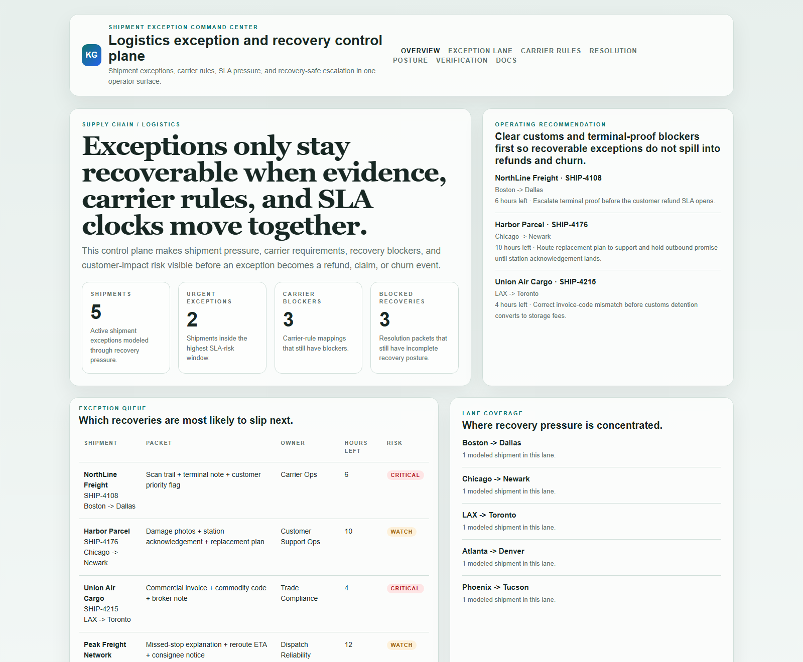
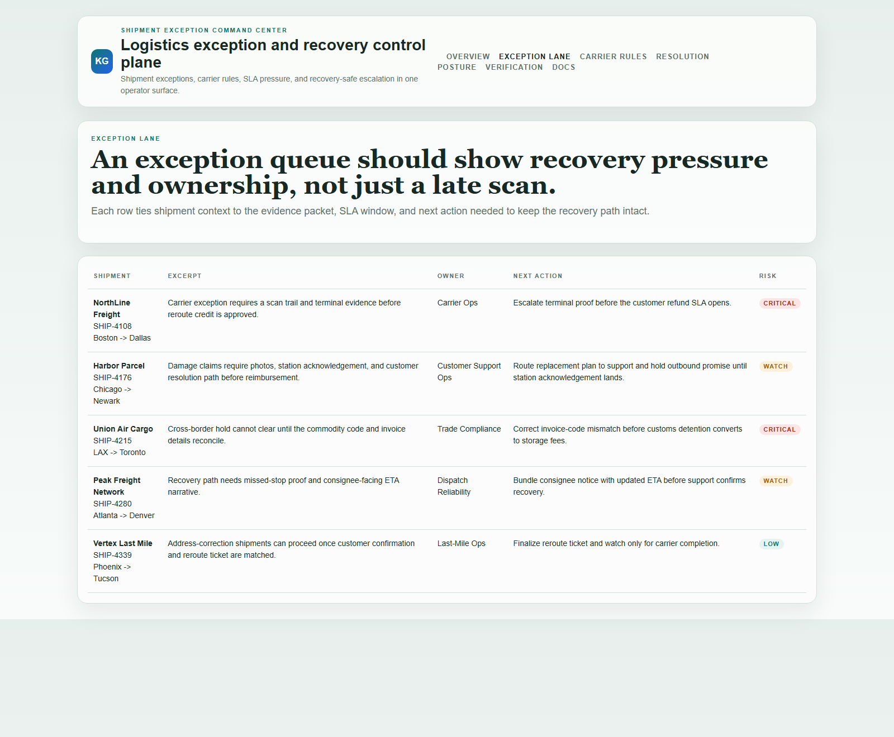
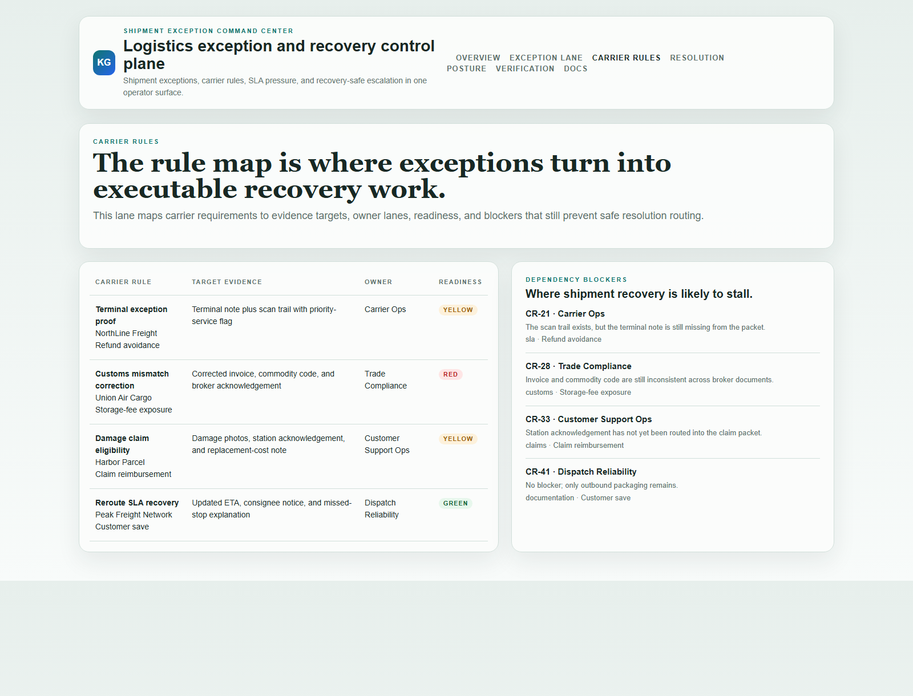
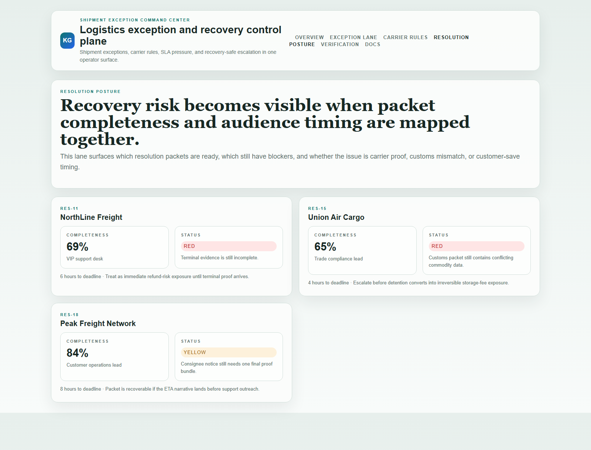

# Shipment Exception Command Center

[](https://github.com/mizcausevic-dev/shipment-exception-command-center/actions/workflows/ci.yml)
[](./LICENSE)
[](./.github/dependabot.yml)
[](https://github.com/mizcausevic-dev/shipment-exception-command-center/actions/workflows/pages.yml)


TypeScript control plane for shipment-exception intake, carrier-rule pressure, resolution routing, and SLA-safe escalation across logistics workflows.

## Why this exists

- Shipment teams lose time when carrier exceptions, SLA clocks, and customer-facing evidence live in separate tools.
- Exceptions often become refunds or churn because the handoff between operations, support, and carrier management breaks down.
- Logistics leaders need to know which shipment is blocked, who owns the next move, and whether the SLA is still recoverable.
- Supply-chain buyers care whether exception handling is auditable and execution-safe, not whether the dashboard uses trendy automation language.

## Why this matters (KG Embedded tie-back)

This repo demonstrates the exception-routing primitive for Supply Chain / Logistics buyers: shipment exceptions tied to carrier rules, SLA pressure, customer-impact blockers, and operator-safe escalation paths. A B2B SaaS buyer would care because fulfillment and exception data often need to surface inside customer-facing tools without exposing unsafe write paths or fragmented operational evidence. Kinetic Gain Embedded extends this into security-first in-product analytics for logistics-aware and SLA-aware reporting across fulfillment and operations workflows, see [kineticgain.com/embedded](https://kineticgain.com/embedded).

## Routes

- `/`
- `/exception-lane`
- `/carrier-rules`
- `/resolution-posture`
- `/verification`
- `/docs`

## API

- `/api/dashboard/summary`
- `/api/exception-lane`
- `/api/carrier-rules`
- `/api/resolution-posture`
- `/api/verification`
- `/api/sample`

## Screenshots






## Local Development

```powershell
cd shipment-exception-command-center
npm install
npm run dev
```

Open:
- [http://127.0.0.1:5462/](http://127.0.0.1:5462/)
- [http://127.0.0.1:5462/exception-lane](http://127.0.0.1:5462/exception-lane)
- [http://127.0.0.1:5462/carrier-rules](http://127.0.0.1:5462/carrier-rules)
- [http://127.0.0.1:5462/resolution-posture](http://127.0.0.1:5462/resolution-posture)
- [http://127.0.0.1:5462/verification](http://127.0.0.1:5462/verification)

## Validation

- `npm run build`
- `npm run test`
- `npm run demo`
- `npm run smoke`
- `npm run render:assets`

## Production status

<!-- Maintained by Claude Code (Platform/SRE lane) after v1.0-prod hardening. -->

| Aspect | Status |
|--------|--------|
| CI | Node 20 + 22 matrix — lint · typecheck · coverage · build · demo · smoke · `npm audit` ([workflow](./.github/workflows/ci.yml)) |
| Test coverage | 100% statements on `src/services/` (gate: ≥ 60%) |
| License | [AGPL-3.0-or-later](./LICENSE) |
| Dependencies | Dependabot weekly (npm + GitHub Actions); `npm audit --audit-level=high` in CI |
| Security | [SECURITY.md](./SECURITY.md) — 0 known high/critical advisories at v1.0-prod |
| Deploy | Static prerender → **https://shipments.kineticgain.com/** (GitHub Pages, [pages workflow](./.github/workflows/pages.yml)) |

## Docs

- [Architecture](./docs/architecture.md)
- [Origin](./docs/ORIGIN.md)
- [Kinetic Gain Embedded tie-back](./docs/KINETIC_GAIN_EMBEDDED.md)
- [Changelog](./CHANGELOG.md)

## Part of the Kinetic Gain Suite

Operator surface in the [Kinetic Gain Suite](https://suite.kineticgain.com/) — a portfolio of buyer-readable control planes spanning security posture, compliance evidence, data-platform governance, FinOps, and operator workflows. See the suite index for related surfaces. Apex: [kineticgain.com](https://kineticgain.com/).
